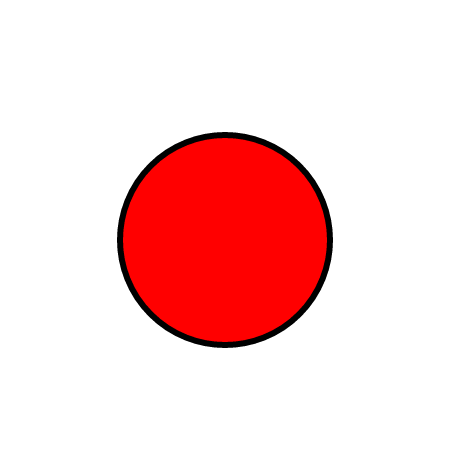

要使用`Konva`删除事件监听，我们可以使用的`off（）`方法
需要事件类型（例如点击或鼠标）和形状对象。   

说明：点击圈子可查看onclick触发的提醒事件绑定。   
通过单击按钮并再次删除事件侦听器  
单击该圆圈以观察事件绑定已被删除。  
Konva Remove_Event Demo[点击查看](https://konvajs.github.io/downloads/code/events/Remove_Event.html)

    <!DOCTYPE html>
    <html>
    <head>
    
    <meta charset="utf-8">
    <title>Konva Remove Event Listener Demo</title>
    
    </head>
    <body>
    

    

    <button id="removeClick">
      Remove onclick
    </button>
    

    
    </body>
    </html>