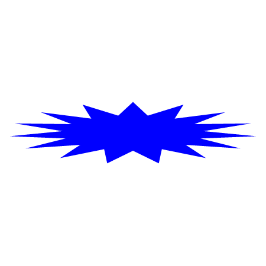

使用`Konva`获取事件目标，我们可以访问target属性
的Event对象。 这在使用事件委托时特别有用，
其中我们可以将事件处理程序绑定到父节点，并监听
发生在它的孩子上的事件。   

 

说明：点击星形并观察层的事件绑定能正确标识所点击的形状。 

Konva Event_Delegation Demo  [点击查看](https://konvajs.github.io/downloads/code/events/Event_Delegation.html) 

    <!DOCTYPE html>
    <html>
    <head>
    
    <meta charset="utf-8">
    <title>Konva Event Delegation Demo</title>
    
    </head>
    <body>
    

    
    </body>
    </html>