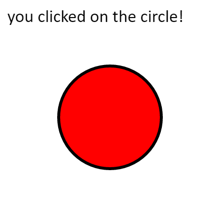

##HTML5 Canvas 使用`Konva` 触发事件 

使用`Konva`触发事件,我们可以用`fire()`方法.   

这使我们能够以编程方式触发事件，如点击，鼠标经过，
鼠标移动等，还可以是自定义事件，如`foo`和`bar`。 

 

Konva Fire_Events Demo [点击查看](https://konvajs.github.io/downloads/code/events/Fire_Events.html)

    <!DOCTYPE html>
    <html>
    <head>
    
    <meta charset="utf-8">
    <title>Konva Fire Event Demo</title>
    
    </head>
    <body>
    

     
    </body>
    </html>