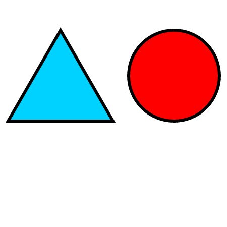

要使用`Konva`将事件处理程序绑定到移动设备上的形状，我们可以使用`on（）`方法.      
  
使用`on（）`方法需要事件类型和回调函数 .   
`Konva` 支持  `touchstart`，`touchmove`，`touchend`，`tap`，`dbltap`，`dragstart`，`dragmove`和`dragend`移动事件。 

  

注意：此示例仅适用于iOS和Android移动设备，因为它使用触摸事件而不是鼠标事件。  

Konva Mobile_Events Demo[点击查看](https://konvajs.github.io/downloads/code/events/Mobile_Events.html)   

    <!DOCTYPE html>
    <html>
    <head>
    
    <meta charset="utf-8">
    <title>Konva Mobile Touch Events Demo</title>
    
    </head>
    <body>
    

    
    </body>
    </html>

