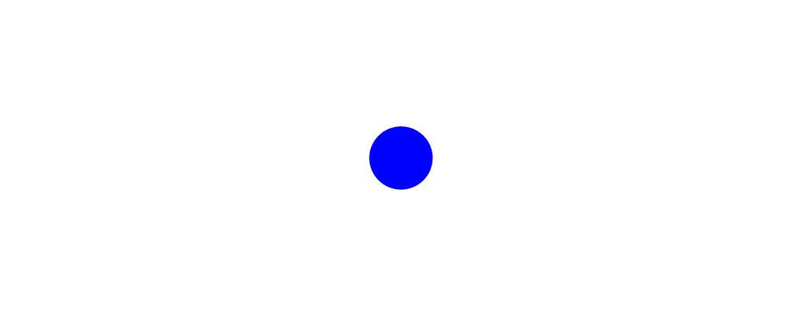

所有事件都从图形开始。 因此，如果您点击画布上的空白空间，点击事件将不会触发图层，甚至没有触发阶段对象。 但是如果你真的需要监控在`Konva.Stage`上空的空间点击（或任何其他类似的事件），你可以： 

1. 创建与`Stage`相同大小的透明矩形，并添加到形状的底部  
2. 或特意监听`content`事件。
  支持的`content`事件：  
`contentMouseover`，`contentMousemove`，`contentMouseout`，   `contentMousedown`，`contentMouseup`，      
`contentClick`，`contentDblclick`，  `contentTouchstart`，`contentTouchmove`，`contentTouchend`，  
`contentTap`，`contentDblTap`.  

 

Konva Stage Events Demo  [点击查看](https://konvajs.github.io/downloads/code/events/Stage_Events.html)  
说明:点击任何地方,然后查看控制台. 

    <!DOCTYPE html>
    <html>
    <head>
    
    <meta charset="utf-8">
    <title>Konva Stage Events Demo</title>
    
    </head>
    <body>
    

    
    </body>
    </html>