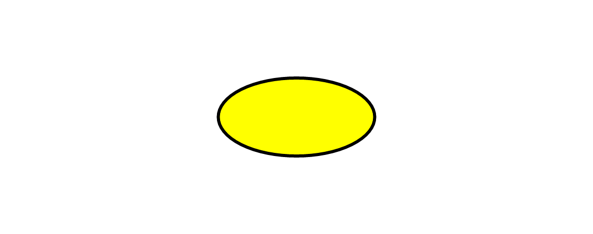

要使用`Konva`创建一个椭圆, 我们可以实例化一个`Konva.Ellipse()`对象.  

有关属性和方法的完整列表,请参阅[Konva.Ellipse](https://konvajs.github.io/api/Konva.Ellipse.html)文档

   

 Konva Ellipse Demo   [点击查看](https://konvajs.github.io/downloads/code/shapes/Ellipse.html)    

    <!DOCTYPE html>
    <html>
    <head>
     
    <meta charset="utf-8">
    <title>Konva Ellipse Demo</title>
    
    </head>
    <body>
    

    
    </body>
    </html>