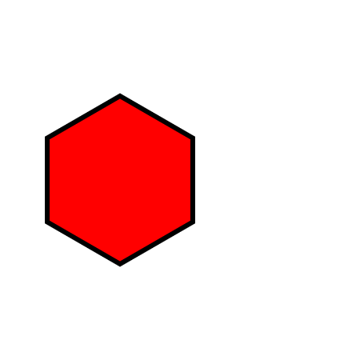

要使用`Konva`添加正多边形, 我们可以实例化一个`Konva.RegularPolygon()`对象.

有关属性和方法的完整列表,请参阅[Konva.RegularPolygon](https://konvajs.github.io/api/Konva.RegularPolygon.html)文档

   

 Konva RegularPolygon Demo   [点击查看](https://konvajs.github.io/downloads/code/shapes/RegularPolygon.html)    

    <!DOCTYPE html>
    <html>
    <head>
    
    <meta charset="utf-8">
    <title>Konva RegularPolygon Demo</title>
    
    </head>
    <body>
    

    
    </body>
    </html>