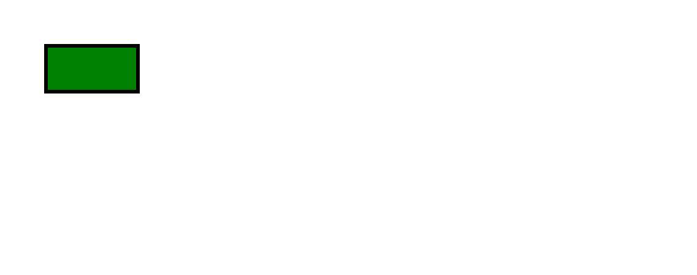

要使用`Konva`创建一个矩形, 我们可以实例化一个`Konva.Rect()`对象.  

有关属性和方法的完整列表,请参阅[Konva.Rect](https://konvajs.github.io/api/Konva.Rect.html)文档

 

 
 Konva Rect Demo [点击查看](https://konvajs.github.io/downloads/code/shapes/rect.html)  

     Konva Rect Demo    
     <!DOCTYPE html>
      <html>
      <head>
       
      <meta charset="utf-8">
      <title>Konva Rect Demo</title>
      
     </head>
     <body>
     

     
     </body>
     </html>

