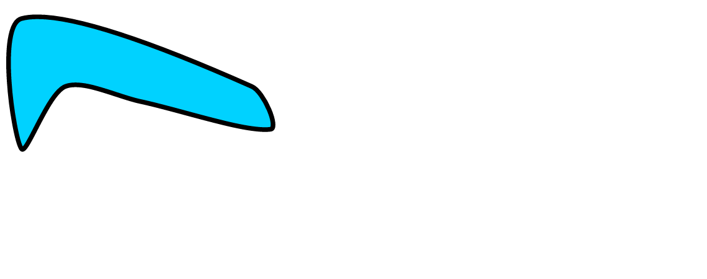

要使用`Konva`创建一个不规则图形, 我们可以实例化一个`Konva.Line()`对象和`closed = true` `tension`属性.

有关属性和方法的完整列表,请参阅[Konva.Line](https://konvajs.github.io/api/Konva.Line.html)文档

   

 Konva Blob Demo   [点击查看](https://konvajs.github.io/downloads/code/shapes/Line_-_Blob.html)  

    <!DOCTYPE html>
    <html>
    <head>
    
    <meta charset="utf-8">
    <title>Konva Line Blob Demo</title>
    
    </head>
    <body>
    

    
    </body>
   </html> 
