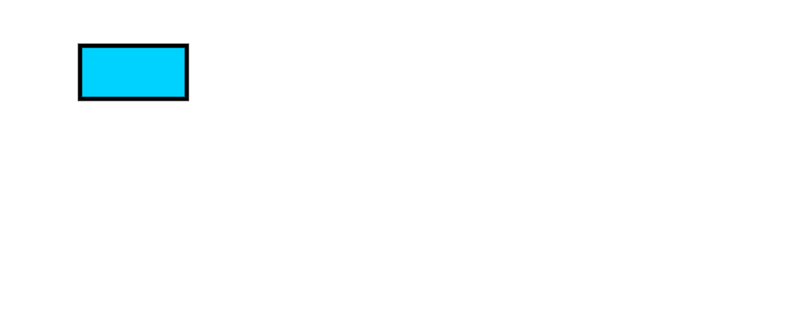

使用`Konva`拖放图形，当我们实例化一个图形时可以设置`draggable`属性为`true`，  
或者我们可以使用`draggable（）`方法。`draggable（）`方法自动支持桌面应用和移动应用。  

要使用`Konva`检测拖放事件，可以使用`on（）`方法
将`dragstart`，`dragmove`或`dragend`事件绑定到节点。
`on（）`方法需要事件类型和回调函数。

 

Konva Drag and Drop Demo [点击查看](https://konvajs.github.io/downloads/code/drag_and_drop/Drag_and_Drop.html) 

    <!DOCTYPE html>
    <html>
    <head>
    
    <meta charset="utf-8">
    <title>Konva  Drag and Drop Demo</title>
    
    </head>
    <body>
    

    
    </body>
    </html>
