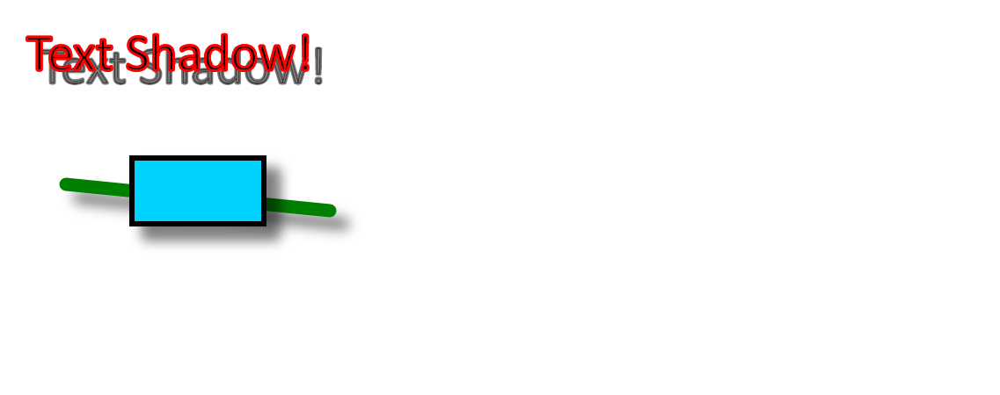

要使用`Konva`绘制阴影，我们可以在实例化形状时设置`shadowColor`，`shadowOffset`，`shadowBlur`和`shadowOpacity`属性。  

我们可以通过使用`shadowColor（）`，`shadowOffset（）`，`shadowBlur（）`和`shadowOpacity（）`方法来调整实例化后的阴影属性。
 

Konva Shadows Demo[点击查看](https://konvajs.github.io/downloads/code/styling/Shadow.html)   

    <!DOCTYPE html>
    <html>
    <head>
    
    <meta charset="utf-8">
    <title>Konva Shadow Demo</title>
    
    </head>
    <body>
    

    
    </body>
    </html>