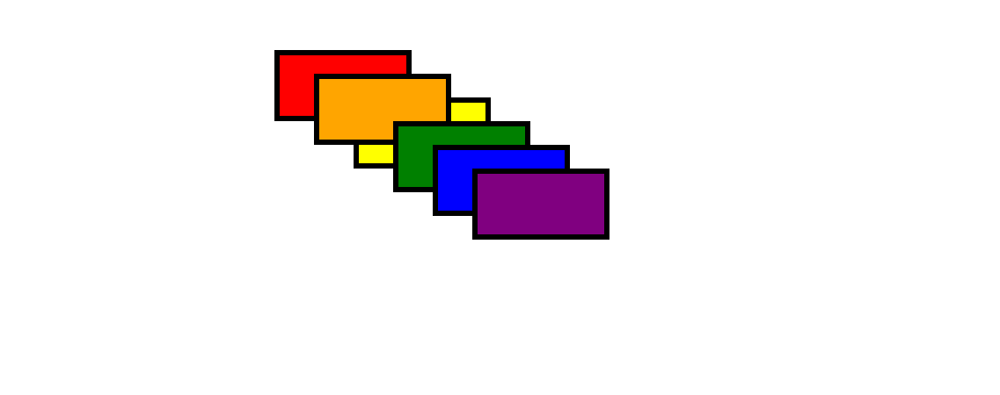

要使用`Konva`的层，我们可以使用以下分层方法之一：
`moveToTop（）`，`moveToBottom（）`，`moveUp（）`，`moveDown（）`或`zIndex（）`。  
您还可以区分层组和层。  

说明：拖放移动它们，然后使用 按钮重新排序。 

Konva Shape Layering Demo [点击查看](https://konvajs.github.io/downloads/code/groups_and_layers/Layering.html)  

    <!DOCTYPE html>
    <html>
    <head>
    
    <meta charset="utf-8">
    <title>Konva Shape Layering Demo</title>
    
    </head>
    <body>
    

    

      <button id="toTop">
          Move yellow box to top
      </button>
      <button id="toBottom">
          Move yellow box to bottom
      </button>
      <button id="up">
          Move yellow box up
      </button>
      <button id="down">
          Move yellow box down
      </button>
      <button id="zIndex">
          Set yellow box zIndex to 3
      </button>
    

    
    </body>
    </html>